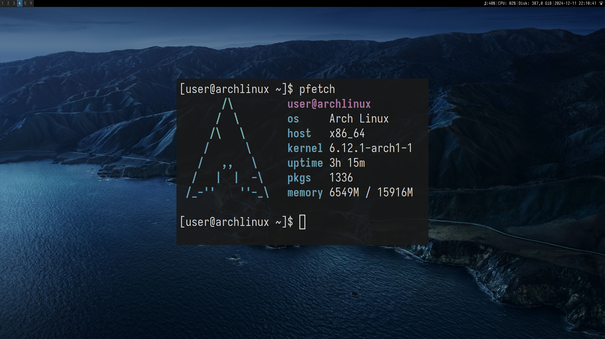

# I3wm Minimalist Setup with Auto-Wallpaper

This repository contains my minimalist dotfile setup for the I3 window manager along with automatic wallpaper management using my [Auto-Wallpaper](https://github.com/mxmchrbrt/Auto-Wallpaper) script.

##Screenshot



## Features

- **I3wm Minimalist Setup:** A simple, clean, and efficient I3 window manager configuration for a smooth, distraction-free workflow.
- **Auto-Wallpaper:** Automatically changes wallpapers based on your preferences using [Auto-Wallpaper](https://github.com/mxmchrbrt/Auto-Wallpaper).
- **Custom Keybindings & Shortcuts:** Preconfigured shortcuts for commonly used applications and tasks.
- **Status Bar Configuration:** I3status or a custom status bar integrated with useful system info.
- **Easy Installation:** Setup in a few simple steps.

## Installation

1. Clone the repository:

    ```bash
    git clone https://github.com/mxmchrbrt/dotfiles
    ```

2. Navigate into the cloned directory:

    ```bash
    cd dotfiles
    ```

3. Run the installation script:

    ```bash
    ./install.sh
    ```
    
## Customization

You can customize this setup further:

- **Keybindings:** Modify the `~/.config/i3/config` file to add or change keybindings.
- **Status Bar:** Edit the status bar settings in `~/.config/i3status/config` or replace it with a different tool like `polybar` for additional features.
- **Wallpaper Sources:** Use the `Auto-Wallpaper` script to add your custom wallpaper sources, or integrate with an online service for daily wallpaper updates.
